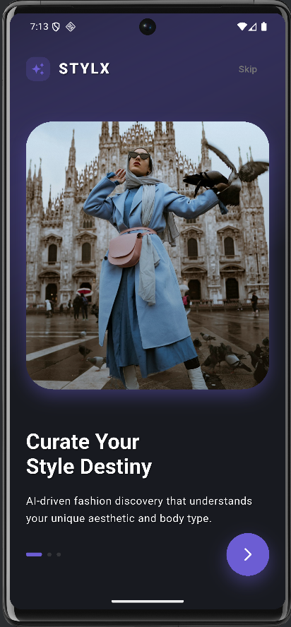

# **Smart Outfit Matcher (AI-Powered Fashion App)**

> A next-generation fashion assistant built with Flutter, Firebase, and Google Gemini AI.

## **📖 Project Overview**
**Smart Outfit Matcher** is not just an e-commerce store; it is an intelligent styling companion. Unlike traditional shopping apps, it solves the "what do I wear with this?" problem using advanced **Multimodal AI**.

Users can upload a photo of any clothing item (e.g., a red hoodie), and the app uses **Google Gemini 2.0 (Vision API)** to analyze its style, color, and vibe. It then intelligently suggests a complete outfit (Bottoms, Shoes, Accessories) and visualizes those suggestions using **Generative AI (Pollinations)** for dynamic ghost-model imagery.

## **🚀 Key Features**

### **1. AI Stylist (Powered by Gemini)**
*   **Visual Analysis**: Upload any clothing item from your camera or gallery.
*   **Smart Matching Logic**:
    *   *Upload a Top* → Suggests Pants, Shoes, & Jacket.
    *   *Upload Shoes* → Suggests Jeans, T-Shirt, & Accessories.
*   **Style Understanding**: Detects "Vibe" (Streetwear, Formal, Casual) and "Color Palette" automatically.

### **2. Generative AI Visualization**
*   **Dynamic Imagery**: Suggested items are not static placeholders. The app uses **Pollinations AI** to generate realistic product images on the fly based on the AI's textual description (e.g., "White leather sneakers professional photography").

### **3. Premium E-Commerce Catalog**
*   **Firebase Backend**: Real-time cloud database (Firestore) storing products.
*   **Auto-Seeder**: One-click "Initialize Catalog" feature that populates the store with 60+ high-quality items (Men, Women, Children).
*   **Smart Filtering**: Filter by Gender, Category, and Price.

### **4. Modern UI/UX**
*   **Glassmorphism**: Sleek, transparent designs.
*   **Animations**: Fluid transitions using `flutter_animate`.
*   **Dark/Light Mode**: Fully responsive theme support.

---

## **🛠️ Technology Stack**

### **Mobile App (Flutter)**
*   **Framework**: Flutter (Dart)
*   **State Management**: Provider
*   **UI Libraries**: `google_nav_bar`, `flutter_staggered_grid_view`, `shimmer`

### **Backend & AI**
*   **Database**: Google Firebase Firestore (NoSQL)
*   **AI Engine**: Google Gemini 2.0 Flash (via PHP Proxy)
*   **Image Generation**: Pollinations AI API
*   **API Layer**: Custom PHP Middleware on Apache (XAMPP/Localhost)


## **📸 Screenshots**

|  |  |
---

## **🔧 Setup Instructions**

### **1. Prerequisites**
*   Flutter SDK installed.
*   Physical Device or Android Emulator (Pixel 6 Pro recommended).
*   Local PHP Server (XAMPP/MAMP) running on port 80.

### **2. Installation**
```bash
# Clone the repository
git clone https://github.com/your-username/smart-outfit-matcher.git

# Navigate to project
cd new_app

# Install dependencies
flutter pub get

# Run the app
flutter run
```

### **3. Setting up the AI**
Ensure your local server is running the `php_api` folder.
*   Place the `php_api` folder in your `htdocs` directory.
*   The app connects to `http://10.0.2.2/php_api/analyze_outfit.php` (special alias for localhost on Android).

---

## **👨‍💻 Author**
**Reda** - Academic Project 2025.
